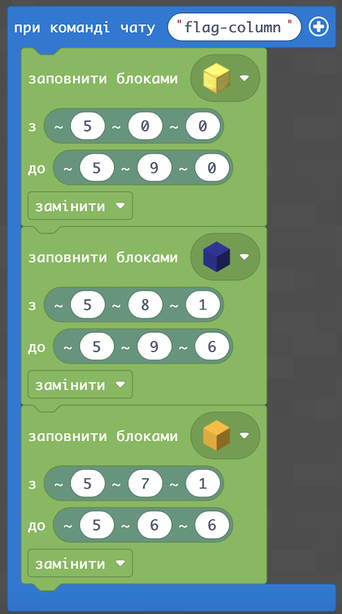
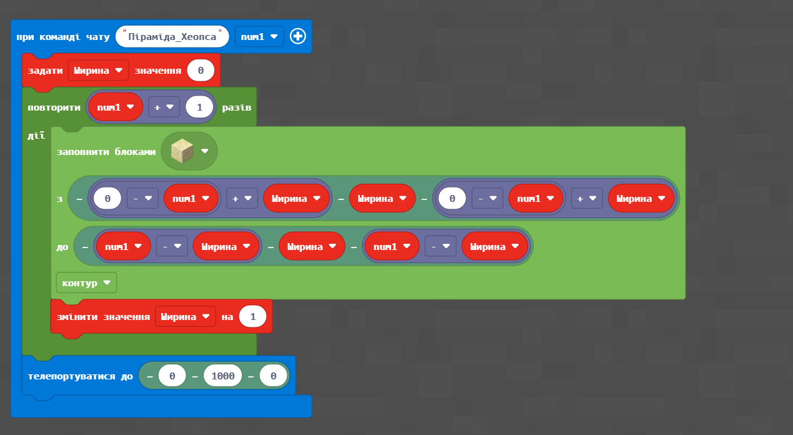

# Подорож до Стародавнього Єгипту: будуємо піраміду

#### Опис


Продовжуємо подорож Стародавнім Єгиптом і знайомство з його культурою. Згадаємо поняття відносних координат і побудуємо колони з різних матеріалів. Дізнаємося про цикли з параметром і створимо диво світу — піраміду!𓀀


## Згадаймо🤔

1. Що таке координати та система координат?&#x20;
2. Що таке відносні координати?&#x20;
3. Що означає знак «-» перед координатою?&#x20;
4. Навіщо потрібні координати під час побудови елементів?

## Сьогодні ми:

1. Створимо колони різної висоти із різних матеріалів за допомогою відносних координат.&#x20;
2. Поставимо прапор України на флагшток.&#x20;
3. Створимо колону, чергуючи різні блоки.&#x20;
4. Дізнаємося про цикли з параметром і навчимося їх використовувати.&#x20;
5. Створимо 6-рівневу піраміду з пісковика за допомогою циклів.&#x20;
6. Створимо диво світу - піраміду Хеопса, за допомогою циклів із параметром.

> **Усі ці навички обов'язково знадобляться під час виконання вашого проєкту!**

## Основні завдання


За часів фараонів колони були невід'ємною частиною давньоєгипетських споруд. Колони копіюють у камені стебла тростини, зв'язані в пучок і обмазані глиною, а також стовбури пальм і т. д. Часто перед колонами встановлювали скульптури різних богів та фараонів. Збудуймо з вами колони різної висоти з матеріалів, які використовувалися в Стародавньому Єгипті!


| **Назва**     | **Колона**                                                                                                                                                                                                                                                                                                                                                                                                     |
| ------------- | -------------------------------------------------------------------------------------------------------------------------------------------------------------------------------------------------------------------------------------------------------------------------------------------------------------------------------------------------------------------------------------------------------------- |
| **Завдання**  | <ol><li>Зробіть колону з блоків золота заввишки <strong>10 блоків</strong>. </li><li>Зробіть колону з дощечок акації заввишки <strong>15 блоків</strong>. </li><li>Зробіть колону зі смарагдових блоків заввишки <strong>11 блоків</strong> </li><li>Зробіть колону з блоків гранітУ заввишки <strong>17 блоків</strong> </li><li>Зробіть колону з блоків глини заввишки <strong>11 блоків</strong>.</li></ol> |
| **Код**       | .png>)                                                                                                                                                                                                                                                                                                                                                                          |
| **Результат** | .png>)                                                                                                                                                                                                                                                                                                                                                                           |

## Самостійно

Напишіть код, де буде побудовано стовп **товщиною в один блок** і висотою в **4 блоки** із дерева, а згори **п’ятим блоком поставиться Світлокамінь**

****

### ****[**Можлива відповідь**](https://sun-rabbit-493.notion.site/4-4a1848c13950469f91c9a0a30b97db1f)****

## Творче завдання

Установіть прапори на флагштоках.

| **Назва**     | **Флагшток**                                                                     |
| ------------- | -------------------------------------------------------------------------------- |
| **Завдання**  | Встановіть на флагштоку із золотих блоків заввишки **10 блоків** прапор України. |
| **Код**       |                                                    |
| **Результат** | .png>)                                             |

## «Листковий пиріг»

| **Назва**     | **«Листковий пиріг»**                                                                                                 |
| ------------- | --------------------------------------------------------------------------------------------------------------------- |
| **Завдання**  | Створіть блок із **5 шарів бетону** в такій послідовності: жовтий, білий, жовтий, білий, жовтий, з основою **5 на 5** |
| **Код**       | .png>)                                                                                  |
| **Результат** | .png>)                                                                                  |

## Наша перша піраміда


Більшість пірамід Стародавнього Єгипту служили у якості усипальниць для фараонів. Але деякі вчені вважають, що піраміди служили місцем для зберігання скарбів та особливо цінних предметів. Збудуймо з вами невелику піраміду для зберігання коштовностей!


На минулих заняттях ми вже навчилися будувати лінії та прямокутники. Використаймо наші знання та побудуємо першу піраміду.

| **Назва**     | **Піраміда для** **коштовностей**                                                 |
| ------------- | --------------------------------------------------------------------------------- |
| **Завдання**  | Створіть **6-ти рівневу піраміду** з пісковика з розміром нижнього шару **11х11** |
| **Код**       | .png>)                                              |
| **Результат** |                                           |

## Піраміда за допомогою циклів


Перш ніж побудувати диво світу, нам потрібно потренуватися на маленьких пірамідах. Давайте побудуємо ще одну піраміду, але вже в інший спосіб!



**Цикл** — набір команд, які можуть виконуватися більше одного разу.&#x20;

**Цикл з параметром** (або лічильником) — цикл, в якому відома кількість повторів послідовності команд.&#x20;

**Параметр або лічильник** — основний показник, за допомогою якого виконується задана конструкція, він збільшується або зменшується — і все повторюється



**Параметр** — це змінна, яка має початкове та кінцеве значення.&#x20;

**Змінна** — це величина, значення якої може змінюватися в процесі виконання програми.&#x20;

В прикладі параметр змінюється 5 раз від **0 до 4**:

.png>)

| **Назва**     | **Піраміда за допомогою циклів**                                                  |
| ------------- | --------------------------------------------------------------------------------- |
| **Завдання**  | Створіть **6-ти рівневу** піраміду з пісковика з розміром нижнього шару **11х11** |
| **Код**       | .png>)                                              |
| **Результат** | .png>)                                              |

## Диво світу — піраміда Хеопса


Давним-давно жив був Хеопс — фараон Стародавнього Єгипту. Одного разу йому наснився віщий сон, який попереджав про низку неврожайних років.&#x20;

Йосип, син Якова, зумів розгадати сон фараона. Імператор Єгипту доручив Йосипу організувати заготівлю зерна. Допоможімо правителю створити піраміду, яка служитиме сховищем зерна у разі великого голоду.


| **Назва**     | **Піраміда Хеопса**                                           |
| ------------- | ------------------------------------------------------------- |
| **Завдання**  | Створіть піраміду Хеопса під час команди `піраміда 50`        |
| **Код**       |  |
| **Результат** | .png>)                          |


P.S. В оновленій версії Minecraft можливі проблеми з будуванням великих пірамід, будуються частково і в повітрі


## **Домашнє завдання**

### Завдання 1

Удосконалити код піраміди так, щоб вона стала більшою (наприклад, висота = 9 блоків)&#x20;

### Завдання 2

Вручну облаштувати середину піраміди: прикрасити, розмістити меблі, картини (здати скріншот у Скулоджі)&#x20;

### Завдання 3 (додатково)&#x20;

Кодом зробити (можна використати Агента або координати) підземні сходи до піраміди&#x20;

### Завдання 4 (додатково)

Відкрити код «Сюрприз» і випробувати його


На наступному занятті продовжимо подорож Стародавнім світом і познайомимося з ще одним чудом світу! Також ви отримаєте навички, які знадобляться для вашого проєкту😉

