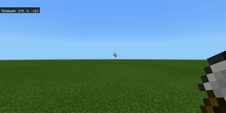

# Viaje al Antiguo Egipto: Construyendo una pirámide

#### Descripción


Continuamos nuestro viaje por el Antiguo Egipto y exploramos su cultura. Recordemos el concepto de coordenadas y construiremos columnas utilizando diferentes materiales. Aprenderemos sobre las coordenadas relativas y crearemos maravillas como las pirámides 𓀀


## Recordemos 🤔

1. ¿Qué son las coordenadas y el sistema de coordenadas?&#x20;
2. ¿Qué son las coordenadas relativas?
3. ¿Qué significa el signo "-" antes de una coordenada?&#x20;
4. ¿Por qué son importantes las coordenadas en la construcción de elementos?

## Hoy haremos lo siguiente:

1. Crearemos columnas de diferentes alturas con diversos materiales utilizando coordenadas relativas.&#x20;
2. Izaremos la bandera de Ucrania en el asta.&#x20;
3. Construiremos una columna alternando diferentes bloques.&#x20;
4. Aprenderemos sobre bucles con parámetros y cómo usarlos.&#x20;
5. Construiremos una pirámide de 6 niveles con arenisca utilizando bucles.&#x20;
6. Crearemos la maravilla del mundo: la pirámide de Keops, utilizando bucles con parámetros.

> **¡Todas estas habilidades serán fundamentales para llevar a cabo su proyecto!**

## Tareas principales


En tiempos de los faraones, las columnas eran una parte integral de las antiguas estructuras egipcias. Estas columnas imitaban en piedra los tallos de las cañas, que se ataban en un manojo y se recubrían con arcilla, así como los troncos de las palmeras, entre otros materiales. Frecuentemente, se colocaban esculturas de varios dioses y faraones frente a las columnas. ¡Construyamos juntos columnas de diferentes alturas utilizando los materiales que se utilizaban en el Antiguo Egipto!


<table data-header-hidden><thead><tr><th width="193"></th><th width="483.27655986509274"></th></tr></thead><tbody><tr><td><strong>Nombre</strong></td><td><strong>Columna</strong></td></tr><tr><td><strong>Tareas</strong></td><td><ol><li>Cree una columna con bloques de oro de <strong>10 bloques</strong> de altura</li><li>Cree una columna con tablones de acacia de <strong>15 bloques</strong> de altura</li><li>Cree una columna con bloques de esmeralda de <strong>11 bloques</strong> de altura </li><li>Cree una columna con bloques de granito de <strong>17 bloques</strong> de altura</li><li>Cree una columna con bloques de arcilla de <strong>11 bloques</strong> de altura</li></ol></td></tr><tr><td><strong>Código</strong></td><td></td></tr><tr><td><strong>Resultado</strong></td><td></td></tr></tbody></table>

## Tarea individual

Escriba un código en el que se construya una **columna de un bloque de ancho** y **4 bloques** de alto, hecha de madera, y encima **se coloque una quinta fila con una Piedra Luminosa**

### [**Posible respuesta**](https://sun-rabbit-493.notion.site/4-4a1848c13950469f91c9a0a30b97db1f)

## Tarea creativa

Coloque banderas en las astas.

<table data-header-hidden><thead><tr><th></th><th width="421.3333333333333"></th></tr></thead><tbody><tr><td><strong>Nombre</strong></td><td><strong>Astas de bandera</strong></td></tr><tr><td><strong>Tarea</strong></td><td>Coloque en el asta de la bandera hecha de bloques dorados una bandera de Ucrania que tenga <strong>10 bloques</strong> de altura</td></tr><tr><td><strong>Código</strong></td><td></td></tr><tr><td><strong>Resultado</strong></td><td></td></tr></tbody></table>

## "Pastel de hojas"

<table data-header-hidden><thead><tr><th></th><th width="444.2197125256674"></th></tr></thead><tbody><tr><td><strong>Nombre</strong></td><td><strong>"Pastel de hojas"</strong></td></tr><tr><td><strong>Tarea</strong></td><td>Cree un bloque con <strong>5 capas de concreto</strong> en la siguiente secuencia: amarillo, blanco, amarillo, blanco, amarillo, con una base de <strong>5 por 5</strong></td></tr><tr><td><strong>Código</strong></td><td></td></tr><tr><td><strong>Resultado</strong></td><td></td></tr></tbody></table>

## Nuestra primera pirámide


La mayoría de las pirámides del Antiguo Egipto servían como tumbas para los faraones. Sin embargo, algunos estudiosos creen que las pirámides también funcionaban como lugares para almacenar tesoros y objetos especialmente valiosos. ¡Construyamos juntos una pequeña pirámide para guardar nuestras riquezas!


En clases anteriores, ya aprendimos a construir líneas y rectángulos. Utilicemos nuestros conocimientos y construyamos nuestra primera pirámide.

<table data-header-hidden><thead><tr><th></th><th width="423.3333333333333"></th></tr></thead><tbody><tr><td><strong>Nombre</strong></td><td><strong>Pirámide de tesoros</strong></td></tr><tr><td><strong>Tarea</strong></td><td>Cree una <strong>pirámide de 6 niveles</strong> utilizando piedra arenisca con un tamaño de base de <strong>11x11</strong></td></tr><tr><td><strong>Código</strong></td><td></td></tr><tr><td><strong>Resultado</strong></td><td></td></tr></tbody></table>

## Construyendo la pirámide usando bucles


Antes de construir maravillas del mundo, necesitamos practicar con pequeñas pirámides. ¡Vamos a construir otra pirámide, pero de una manera diferente!



Un **bucle** es un conjunto de comandos que pueden ejecutarse más de una vez.&#x20;

Un **bucle con parámetro** (o contador) es un bucle en el que se conoce la cantidad de repeticiones de la secuencia de comandos.&#x20;

El **parámetro o contador** es el indicador principal que controla la construcción, aumentándose o disminuyendo, y repitiendo todo



El **parámetro** es una variable que tiene un valor inicial y final.&#x20;

Una **variable** es una cantidad cuyo valor puede cambiar durante la ejecución del programa.&#x20;

En el ejemplo, el parámetro cambia 5 veces, **de 0 a 4:**

.png>)

<table data-header-hidden><thead><tr><th></th><th width="441.61458846722525"></th></tr></thead><tbody><tr><td><strong>Nombre</strong></td><td><strong>Pirámide con bucles</strong></td></tr><tr><td><strong>Tarea</strong></td><td>Cree una pirámide de <strong>6 niveles</strong> utilizando bloques de piedra arenisca con un tamaño de base de <strong>11x11</strong></td></tr><tr><td><strong>Código</strong></td><td></td></tr><tr><td><strong>Resultado</strong></td><td></td></tr></tbody></table>

## Maravilla del mundo: [Pirámide de Keops](https://makecode.com/\_0icTFfeEAYPx)


Hace muchísimo tiempo, vivía Keops, el faraón del antiguo Egipto. En una ocasión, tuvo un sueño profético que advertía sobre una serie de años de escasez de cosechas.&#x20;

José, hijo de Jacob, pudo interpretar el sueño del faraón. El emperador de Egipto le encomendó a José organizar la recolección de grano. Ayudemos al gobernante a construir una pirámide que servirá como almacén de grano en caso de una gran hambruna.


<table data-header-hidden><thead><tr><th></th><th width="427.504640937958"></th></tr></thead><tbody><tr><td><strong>Nombre</strong></td><td><strong>Pirámide de Keops</strong></td></tr><tr><td><strong>Tarea</strong></td><td>Cree la pirámide de Keops cuando se dé el comando <code>pirámide 50</code></td></tr><tr><td><strong>Código</strong></td><td></td></tr><tr><td><strong>Resultado</strong></td><td></td></tr></tbody></table>


P.D. En la versión actualizada de Minecraft, pueden surgir problemas al construir grandes pirámides, ya que se construyen parcialmente en el aire


## **Tarea**

### Tarea 1

Mejorar el código de la pirámide para que sea más grande (por ejemplo, altura = 9 bloques)&#x20;

### Tarea 2

Decorar manualmente el interior de la pirámide, colocando muebles y cuadros (enviar captura de pantalla en Schoology)

### Tarea 3 (adicional)&#x20;

Crear escaleras subterráneas hacia la pirámide utilizando código (puedes usar al Agente o coordenadas)

### Tarea 4 (adicional)

Abrir el código ["Sorpresa"](https://minecraft.makecode.com/89430-04947-07247-09022) y pruebelo.


En la próxima sesión, continuaremos nuestro viaje por el Mundo Antiguo y conoceremos otra maravilla del mundo. También adquirirán habilidades que serán útiles para su proyecto 😉

